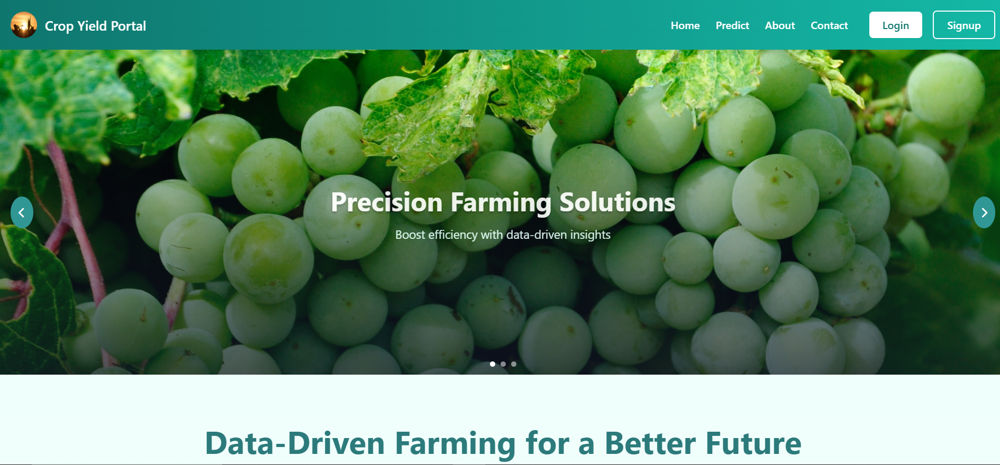

# 🌾 Crop Yield Prediction Portal Using Weather Data 🌦️


*Empowering farmers with real-time weather-based yield predictions!*

## 🌍 Overview
The **Crop Yield Prediction Portal** is a powerful web application designed to help farmers make **data-driven decisions** by predicting crop yields based on **real-time weather data**. By simply entering their **state and city name**, users can access accurate weather information, enabling them to plan their agricultural activities efficiently. 

Built with **HTML, CSS (Tailwind CSS), JavaScript, and PHP**, this portal integrates a **Weather API** to fetch live weather data and provides **insightful charts** 📊 to visualize trends affecting crop productivity. With a seamless and intuitive interface, this system ensures an effortless user experience while maintaining a well-structured and optimized codebase.

---

## 🌟 Key Features
✅ **Real-Time Weather Data:** Automatically fetches weather conditions like **temperature, humidity, and rainfall** based on the user’s state and city.  
✅ **Intelligent Yield Prediction:** Processes weather parameters and provides actionable insights into expected crop yields.  
✅ **Dynamic Data Visualization:** Interactive **charts** 📈 help farmers analyze weather trends and their impact on crops.  
✅ **User Authentication:** 🔐 Secure **registration and login** system using MySQL database and PHP sessions.  
✅ **User-Friendly Interface:** Designed with **Tailwind CSS** 🎨 for a sleek, responsive, and mobile-friendly experience.  
✅ **High-Performance Backend:** Efficient **PHP** and **JavaScript** handling ensure smooth operation and fast responses.  
✅ **Clean and Maintainable Code:** Well-structured for **readability, scalability, and future enhancements**.  

---

## 💻 Technologies Used
🔹 **HTML & CSS (Tailwind CSS):** For structuring and styling the interface.  
🔹 **JavaScript:** Enhances interactivity and renders analytical charts.  
🔹 **PHP:** Handles backend logic, authentication, and processes weather data.  
🔹 **MySQL:** Stores user credentials, session data, and relevant application records.  
🔹 **Weather API:** Fetches real-time weather information (e.g., OpenWeatherMap).  
🔹 **Chart.js:** Generates interactive charts for **weather trend analysis**.  

---

## 🛠️ Prerequisites
Before running the project, ensure you have the following installed:  
✅ **Apache Web Server** (e.g., via XAMPP, WAMP, or MAMP).  
✅ **PHP 7.4 or higher** (for backend processing).  
✅ **MySQL Database** (for managing user authentication and weather data).  
✅ **A Weather API Key** (obtainable from [OpenWeatherMap](https://openweathermap.org/) or another provider).  
✅ **A modern web browser** (Chrome, Firefox, Edge, etc.).  

---
## 🖥️ Demo Page

Here’s a sneak peek of the platform in action:



## 🚀 Installation Guide
Follow these steps to set up the project on your local machine:

### 1️⃣ Clone the Repository
```bash
git clone https://github.com/vaibhav1826/Crop_Yield_Prediction.git
```

### 2️⃣ Set Up the Web Server
- Move the project folder to your web server’s root directory (e.g., `htdocs` for XAMPP).
- Start your web server (Apache) and ensure PHP is enabled.

### 3️⃣ Configure the Database
- Create a MySQL database (e.g., `crop_yield_db`).
- Import the database schema from `database/schema.sql` (if available).
- Update the database credentials in `config/database.php` with your MySQL details.

### 4️⃣ Integrate the Weather API
- Sign up for a **Weather API key** (e.g., from OpenWeatherMap).
- Add your API key to the configuration file (e.g., `config/api.php`).

### 5️⃣ Set Up User Authentication 🔒
- The portal allows users to **register and log in securely**.
- Passwords are hashed using PHP’s `password_hash()` function.
- PHP **sessions track logged-in users** and restrict access to protected pages.
- Logout functionality ensures users can securely end their session.

### 6️⃣ Launch the Application 🌱
- Open your web browser and visit:  
  **➡️ `http://localhost/Crop_Yield_Prediction`**  
- Register an account or log in to start exploring **weather-based crop yield predictions effortlessly!**  

---

🌾 **This portal empowers farmers with data-driven insights, enabling better crop management and maximizing agricultural productivity.** 🌱💡  

*Smart farming begins with smart decisions!* 🚜💻

